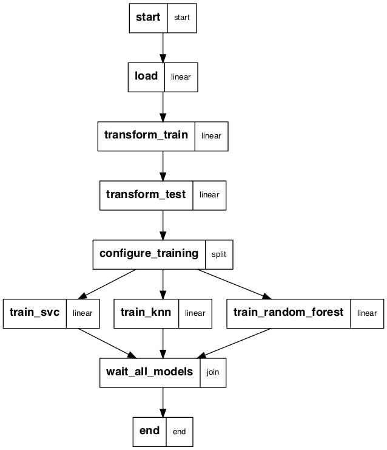

# titanic-clean-code
Example of productization process of a Data Science Jupiter notebook

The productized data transformations are [here](./titanic_productization.py)

The [history of this repo](https://github.com/SergiiVolodkoWorking/titanic-clean-code/commits/main) shows the refactoring / productization process step by steps


### Userful commands
To convert notebook into long python script execute:
```
python3 -m jupytext --to py ./notebooks/titanic-prod.ipynb 
```

To execute ml_pipeline
```
python3 ml_pipeline.py run
```

## Result
Exploration notebook transformed into Machine Learning pipeline

